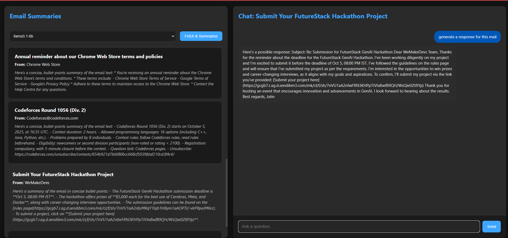

Mail Summarizer AI (3-Tier Architecture)
This project has been refactored into a three-tier web application architecture.

Architecture Overview
Frontend: A lightweight Flask server that serves the main user interface. It's a single-page application built with HTML, CSS, and vanilla JavaScript. It runs on port 8080.

Backend: A Flask API server that handles all the business logic. It connects to Gmail to fetch emails, communicates with the Cerebras AI API for summarization and chat, and exposes endpoints for the frontend to consume. It runs on port 5000.

Cloud AI: The external Cerebras API, which acts as our third tier for all machine learning model inferences.  

File Structure
Mail_Summerizer/
├─ frontend/
│  ├─ static/
│  │  └─ style.css     # UI design
│  │  └─ script.js     # Logic to make requests and recieve response
│  ├─ templates/
│  │  └─ index.html    # Main UI for email summaries and chat
│  ├─ app.py           # Simple Flask server to serve the frontend
│  ├─ Dockerfile       # Dockerfile for the frontend service
│  └─ requirements.txt # Python dependencies for the frontend
├─ backend/
│  ├─ app.py           # Backend Flask API (fetches mail, calls AI)
│  ├─ Dockerfile       # Dockerfile for the backend service
│  └─ requirements.txt # Python dependencies for the backend
├─ .env                # Environment variables (credentials, API keys)
└─ docker-compose.yml  # Orchestrates the frontend and backend services

How to Run
Fill in your credentials in the .env file. You need your Gmail email, a Gmail App Password, and your Cerebras API key.  
GMAIL_USER = "yourmail"
GMAIL_APP_PASSWORD = "your password for third party use from google account"
CEREBRAS_API_KEY = "your cerebras api key"

Build and run the services using Docker Compose:

docker-compose up --build

Access the application by opening your web browser and navigating to:
http://localhost:8080

