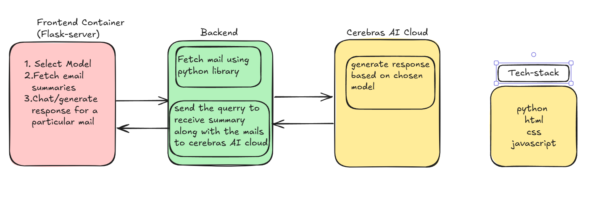

__Mail Summarizer AI__  

This project is an AI-powered Mail Assistant designed to enhance email productivity. It securely connects to a user's Gmail account, fetches the latest emails, and uses a powerful large language model from the Cerebras AI Cloud to provide concise summaries.

A key feature is the interactive chat interface. Users can select any summarized email and ask specific questions about its content, receiving instant, context-aware answers from the AI.

The application is built on a modern three-tier architecture, ensuring scalability and a clean separation of concerns:

1. A lightweight frontend service built with HTML, CSS, and JavaScript that runs in the browser.

2. A robust backend API built with Python and Flask, which handles all business logic, including fetching emails and         communicating with the AI service.

3. The Cerebras AI Cloud, which serves as the third tier, performing all the complex natural language processing tasks.

The entire system is containerized using Docker and orchestrated with Docker Compose, making it easy to set up and run in any environment.

Architecture Overview
Frontend: A lightweight Flask server that serves the main user interface. It's a single-page application built with HTML, CSS, and vanilla JavaScript. It runs on port 8080.

Backend: A Flask API server that handles all the business logic. It connects to Gmail to fetch emails, communicates with the Cerebras AI API for summarization and chat, and exposes endpoints for the frontend to consume. It runs on port 5000.

Cloud AI: The external Cerebras API, which acts as our third tier for all machine learning model inferences.  

FILE STRUCTURE

How to Run
Fill in your credentials in the .env file. You need your Gmail email, a Gmail App Password, and your Cerebras API key.  
GMAIL_USER = "yourmail"
GMAIL_APP_PASSWORD = "your password for third party use from google account"
CEREBRAS_API_KEY = "your cerebras api key"

Build and run the services using Docker Compose:

docker-compose up --build

Access the application by opening your web browser and navigating to:
http://localhost:8080

